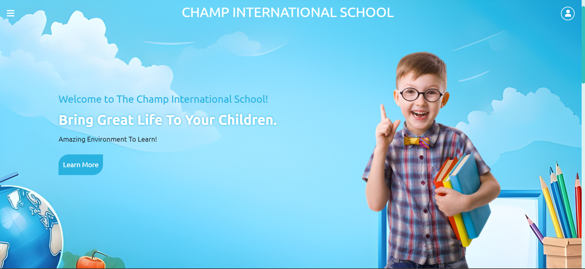

# School_Admin_System
A User friendly end to end Admin interface with login authentication to enroll,modify and view various data encountering in day to day work.

The prime intuition in developing the website is to provide an attractive and a quite handy interface for the school admin employees to work with the data which they deal with in their day to day operations.

#### Run the project in local environment 
Clone the github repository through the following command : ``` git clone 
https://github.com/bgvshiva2004/School_Admin_System.git ```

## Team 
* K.Niketh Reddy : 220001040 / CSE / IIT INDORE
* B.G.V.Shiva : 220002029 / CSE / IIT INDORE
* P.Madan : 220001043 / CSE / IIT INDORE
* K.Tejaswini Raj : 220001041 / CSE / IIT INDORE

## Web Interface


## Prerequisites 
### Front-end
* HTML
* CSS
* JS
### Back-end
* Django
* MySQL

  ## Usage and Web Workflow
  * After giving a glance over the home page and other additional pages,the user navigates to the login page where the login box with the credentials of username and password are present besides an additional dropdown slot- role which has the values Admin, Employee, Student.
  * Though the further interface and working operations are provided only for the person with admin role, the future development relies on developing an interface for the student and employee as well.

  
